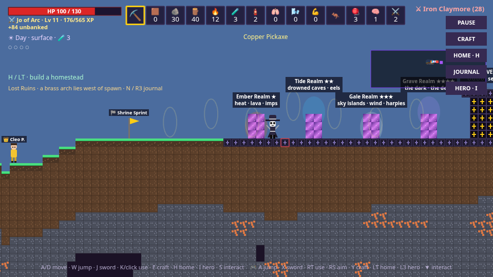
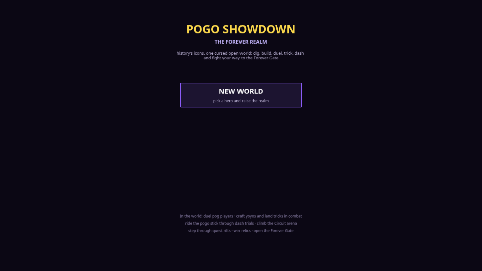
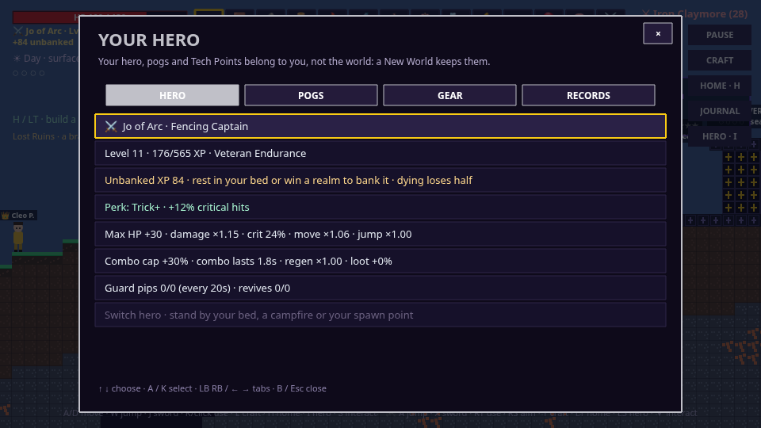
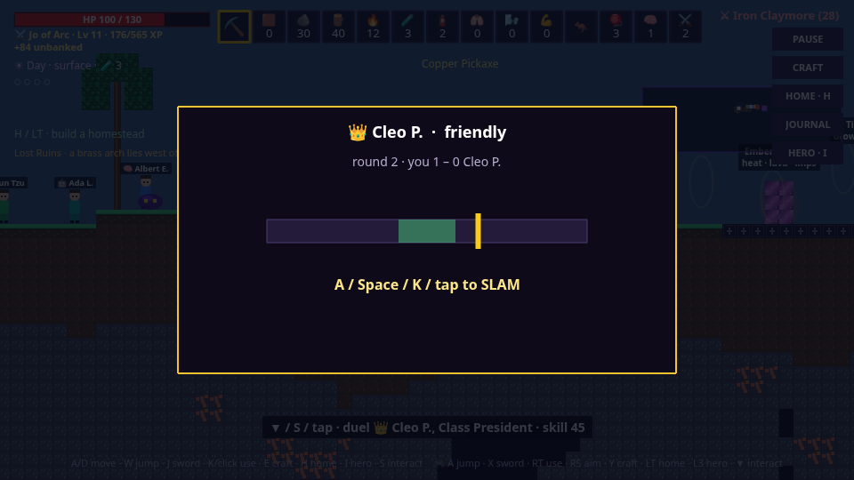
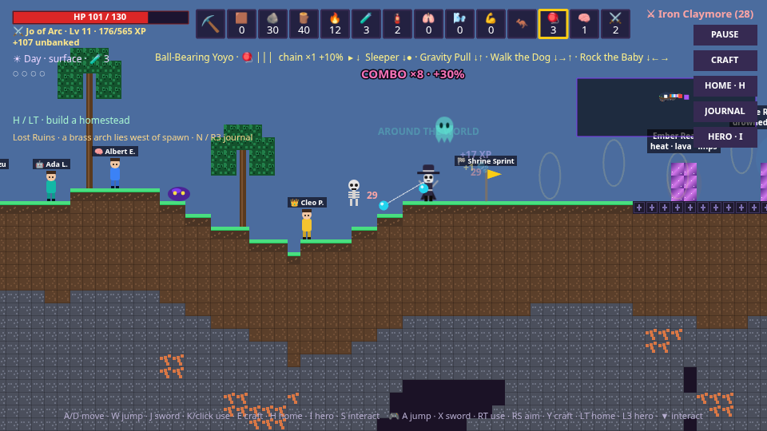
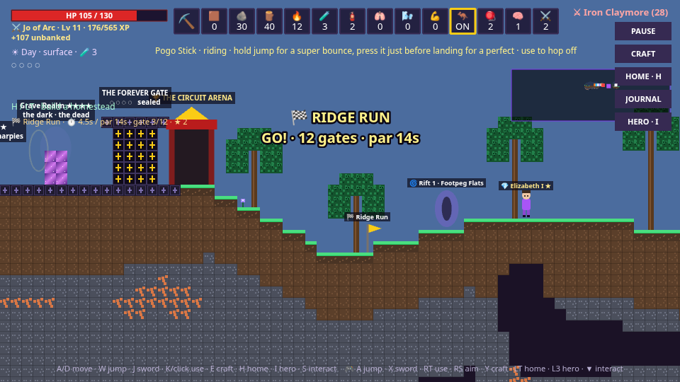
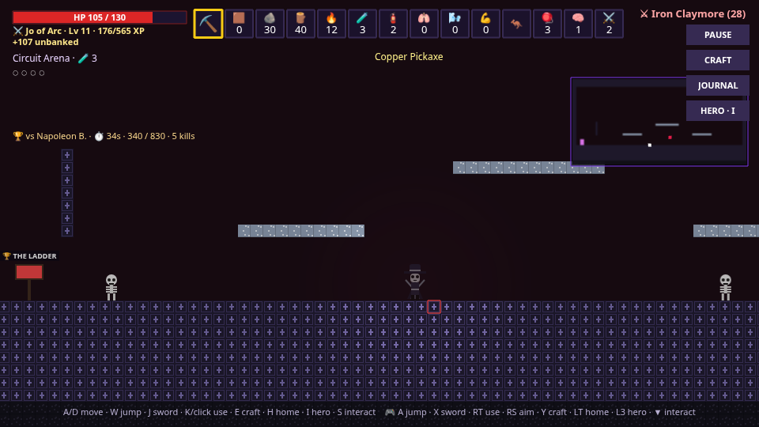
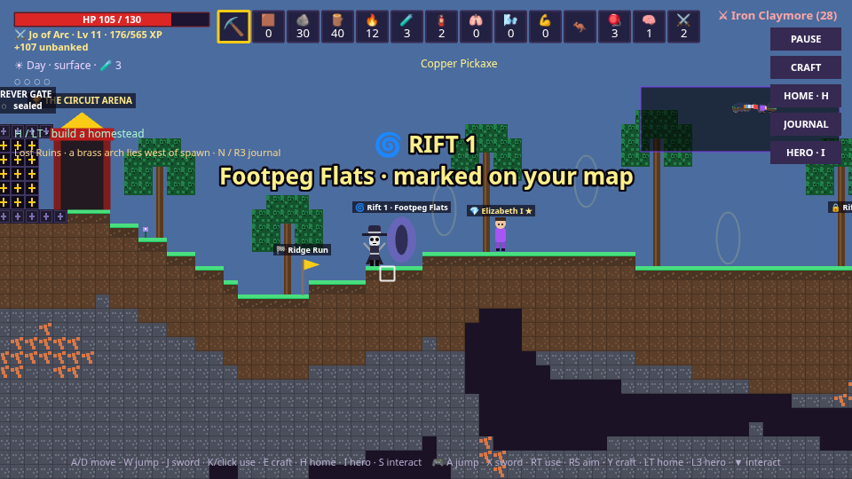
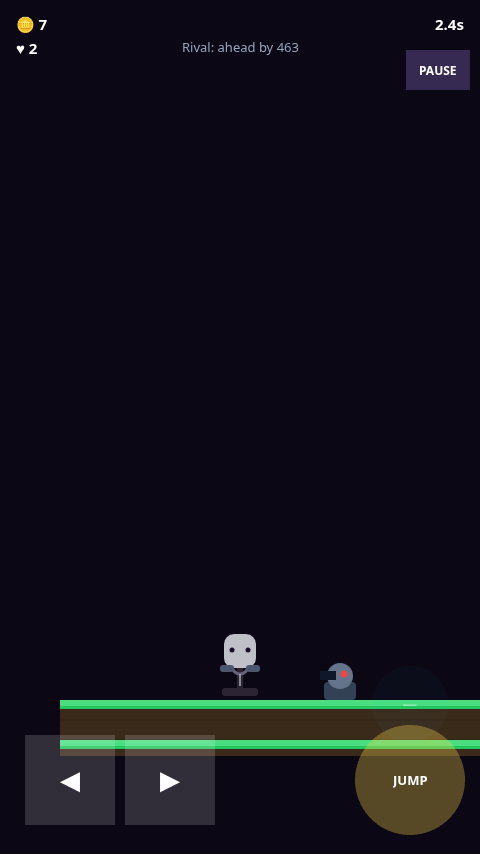
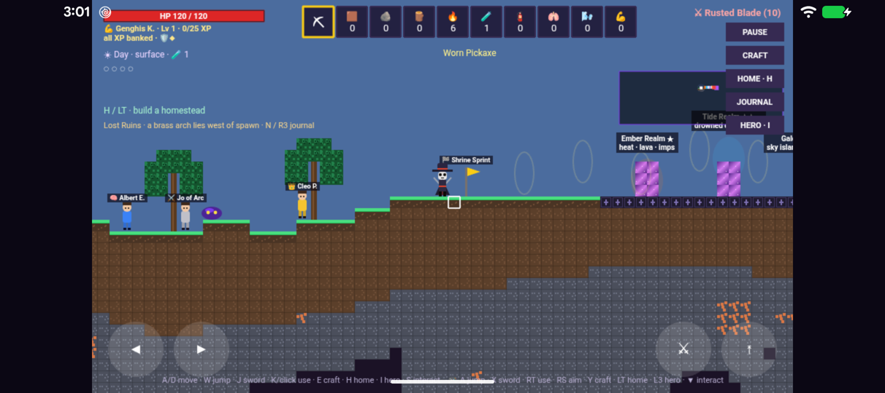

# Pogo Showdown: The Forever Realm

History's icons are highschoolers with a pogo stick, and they're stuck in one cursed open world. Dig and build like Terraria, fight Chakan-style through four elemental realms to the Forever Gate, and do everything else there too: duel pog players, land yoyo tricks mid-fight, bounce through Dash Trials, climb the Circuit Arena and step through Pog Quest rifts.

It's a single-player Phaser 4 + TypeScript game. It runs in the browser, on Android (Capacitor), and on Linux from an RPM. Saves stay on the device.



## One world, every game

The Forever Realm used to be one of eight menu modes. Now it's the whole game, and the other seven live inside it:

| In the world | What it was | How it plays |
|---|---|---|
| **Your hero** | Character select, per-character mastery | Pick one of eight highschoolers. Their perk becomes a combat stat. Each hero levels to 20 on XP, with mastery tiers every five levels. |
| **Footpeg pogs** | Pog Binder, pog perks | Equipped pogs give Realm stats: revives, guard pips, crit, loot, combo cap and speed. Their Pog Quest abilities join the hotbar: freeze, slammer throw, ground pound, shield, speed, plunder, double jump and heal. |
| **Duelists** | Pog Battles | Highschoolers practise in the Schoolyard. The eleven Circuit pros haunt the map, the best three deep underground. Slam bouts can be Friendly or For keeps, and a For-keeps loss costs your stake. |
| **Yoyo tricks** | Yoyo Trick Lab | Craft a yoyo and throw it, then flick a trick's inputs before the window closes. Twenty tricks, from Sleeper to Kwyjibo. Fumbles snap strings. |
| **Pogo stick + Dash Trials** | Pogo Dash | A craftable mount with super bounces, perfect-timing bounces and stomps. Three gate-and-star courses award medals and a Pogo Rank. |
| **Circuit Arena** | The Circuit | A colosseum ladder of eleven pros. Each runs a sixty-second bout with its own rules. |
| **Quest rifts** | Pog Quest | The fifteen platformer levels are rifts across the overworld. Clear one and you come back out beside it. |
| **Tech Points** | Loadout | Earned once each from firsts: bosses, pro duels, gold medals, arena wins and rift clears. They buy footpeg room. |
| **Records** | Leaderboard | The hero menu's RECORDS tab. |

| | |
|---|---|
|  |  |
|  |  |
|  |  |
|  |  |



### Risk and reward, in one loop

- **Unbanked XP.** XP only counts once you sleep in your bed or win a realm. A real death loses half of what you carry.
- **Style combo.** Chained hits add up to +30% damage (more for some heroes and pogs). Taking a hit resets it.
- **Stakes.** For-keeps duels pay a signature pog once per realm day. Lose one to a pro and the pog you staked is gone.
- **Hardcore and Showboat.** A Dash Trial where one hit ends the run, and an arena bout with a higher mark, both for bigger rewards.
- **Strings.** Wrong trick inputs snap yoyo strings, and three snaps tangle the yoyo.
- **The pogo stick.** It's fast and it stomps, but hits hurt 25% more while you ride and you don't regenerate.

## Controls

| Action | Keyboard / mouse | Controller | Touch |
|---|---|---|---|
| Move / jump | A D / W or Space | Left stick / A | ◀ ▶ / ⤒ |
| Sword | J or right click | X | ⚔ |
| Use hotbar (mine, place, throw yoyo, pogo, pog ability) | K or left click | RT (right stick aims) | tap the world |
| Hotbar | 1–0, mouse wheel | LB / RB | tap a slot |
| Yoyo trick inputs | arrow keys (● = K) | right-stick flicks (● = RT) | trick pad |
| Hero menu | I | L3 | HERO button |
| Craft / home / journal | E / H / N | Y / LT / R3 | buttons |
| Interact, duel, enter | S or ↓ | D-pad down | tap the prompt |
| Potion / map / pause | Q / Tab / Esc | B / View / Menu | — |

## Install

- **Android:** grab `pogo-showdown-v0.5.0.apk` from [Releases](https://github.com/9x25dillon/pogo-showdown/releases). The app plays in landscape.
- **Fedora / RHEL / openSUSE:** `sudo dnf install ./pogo-showdown-0.5.0-1.noarch.rpm`, then launch **Pogo Showdown** from your app menu or run `pogo-showdown`. It serves the game on `127.0.0.1:47219` and opens your browser. The port is fixed so your saves persist; set `POGO_PORT` to change it.
- **Any browser:** `npm install && npm run build`, then serve `dist/`.

## Develop

```sh
npm install
npm run dev                  # http://localhost:5173
npm run build                # type-check + production build
npm run android:apk          # debug APK (see PLAY_STORE.md for SDK/JDK setup)
npm run android:release      # signed release APK + AAB
npm run package:rpm          # RPM via a Fedora container (needs Docker)
```

Browser regression tests drive the real game through Chrome DevTools. Start the dev server and a Chromium with `--remote-debugging-port=9333`, then run `POGO_URL=http://127.0.0.1:5173 npm run test:browser`. Set `POGO_SUITE=unified|homestead|foundry` for one suite. `Hand_off.md` has the full playbook, code map and open questions.

The game's balance lives in pure modules, so tuning happens in one place: `src/game/realm/hero.ts` (levels, perks, pog stats), `duels.ts`, `yoyo.ts`, `dash.ts`, `arena.ts`, `rifts.ts` and `items.ts`.

## Credits

Code and procedural art by the Pogo Showdown project. Soundtrack by the developer. All rights reserved.
